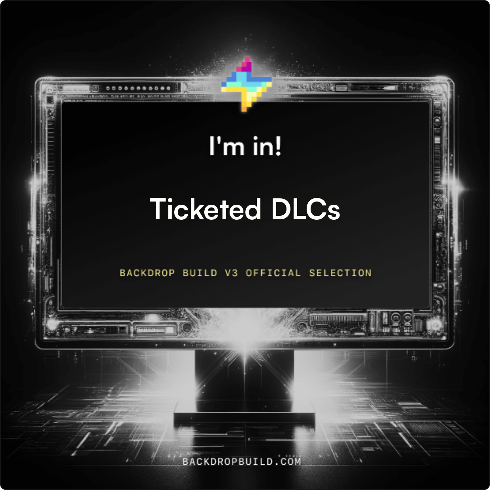
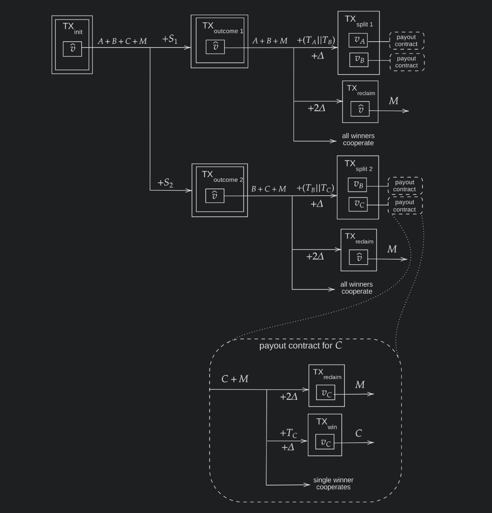

# dlctix

Ticketed [Discreet Log Contracts (DLCs)](https://bitcoinops.org/en/topics/discreet-log-contracts/) to enable instant buy-in for conditional payment contracts on [Bitcoin](https://bitcoin.org).

This project is part of the [Backdrop Build V3 cohort](https://backdropbuild.com) 

### Summary

To read more about this concept in detail, [see my full blog post](https://conduition.io/scriptless/ticketed-dlc/).

A group of people don't trust each other, but DO trust some 3rd-party mediator called an _Oracle._ They want to wager money on some future event and redistribute the money depending on which outcome occurs (if any), according to the Oracle. Real-world examples include:

- Futures contracts (e.g. Contracts for Derivatives)
- Insurance contracts
- Security deposits (e.g. for car rentals)
- Gambling
- Competition prizes

[Discreet Log Contracts (DLCs)](https://bitcoinops.org/en/topics/discreet-log-contracts/) enable this kind of conditional payment to be executed natively on Bitcoin, with great efficiency. They have been known about for many years, but traditional DLCs are not scaleable to large contracts with many people buying in with very small amounts, such as lotteries or crowdfunding, because a traditional DLC requires on-chain Bitcoin contributions _from every participant_ in the DLC who is buying in - otherwise the contract would not be secure. The fees on such a jointly-funded contract quickly become impractical. There are also privacy issues: Every participant would be permanently associating their on-chain bitcoins with the DLC in question.

With my Ticketed DLCs approach, a single untrusted party called the Market Maker can lease their on-chain capital to use for the on-chain DLC, while buy-ins from the DLC contestants are instead paid to the Market Maker using off-chain payment protocols such as [Fedimint eCash](https://fedimint.org/) or [Lightning](https://lightning.network). The Market Maker can profit from this arrangement by charging the contestants an up-front fee which covers the opportunity cost of locking their on-chain capital for the duration of the DLC.

DLC contestants buy specific SHA256 preimages called _ticket secrets_ from the Market Maker off-chain. In so doing, a DLC contestant is buying the ability to redeem potential payouts from the DLC. Without the correct ticket secret, any winnings instead return to the Market Maker.

Once the Oracle publishes an attestation confirming the true outcome of the DLC, the Market Maker can issue off-chain payouts to the DLC winners. In exchange, the Market Maker receives a _payout preimage_ from each contestant which allows the Market Maker to reclaim his on-chain capital.

In the optimal case if everyone cooperates and payouts are conducted off-chain, there are only two on-chain transactions: The funding of the DLC by the Market Maker, and the withdrawal back to the Market Maker. **The result is zero on-chain visibility into who participated or won the DLC, and the absolute best on-chain efficiency possible** while still retaining the guarantee of on-chain contract enforcement. Assuming the Oracle is trustworthy, then the correct winners will always be paid out eventually, regardless of whether the Market Maker or the contestants cooperate, collude, or go offline.

## Code

This repository is a reusable Rust implementation of the Ticketed DLC contract using hash-locks.

It implements the transaction-building, multisignature-signing, and validation steps needed for all parties (both contestants and the Market Maker) to successfully execute a Ticketed DLC on and off-chain. It _does not_ include any networking code, nor does it package a Bitcoin or Lightning Network wallet. Rather, this crate is a generic building block for higher-level applications which can implement Ticketed DLCs in more specific contexts.

To demonstrate the practicality of this approach, I have written [a series of integration tests](./src/regtest.rs) which leverage a remote [Bitcoin Regtest Node](https://bisq.network/blog/how-to-set-up-bitcoin-regtest/) to simulate and test the various stages and paths of the Ticketed DLC's on-chain execution. The best way to visualize these stages is with a transaction diagram.

## Walkthrough

To see an example, see [the basic integration test](./tests/basic.rs) which includes very detailed comments and descriptions of everything happening during the DLC construction, signing, and execution phases.
